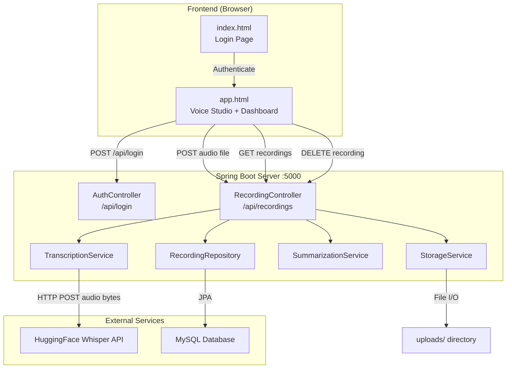
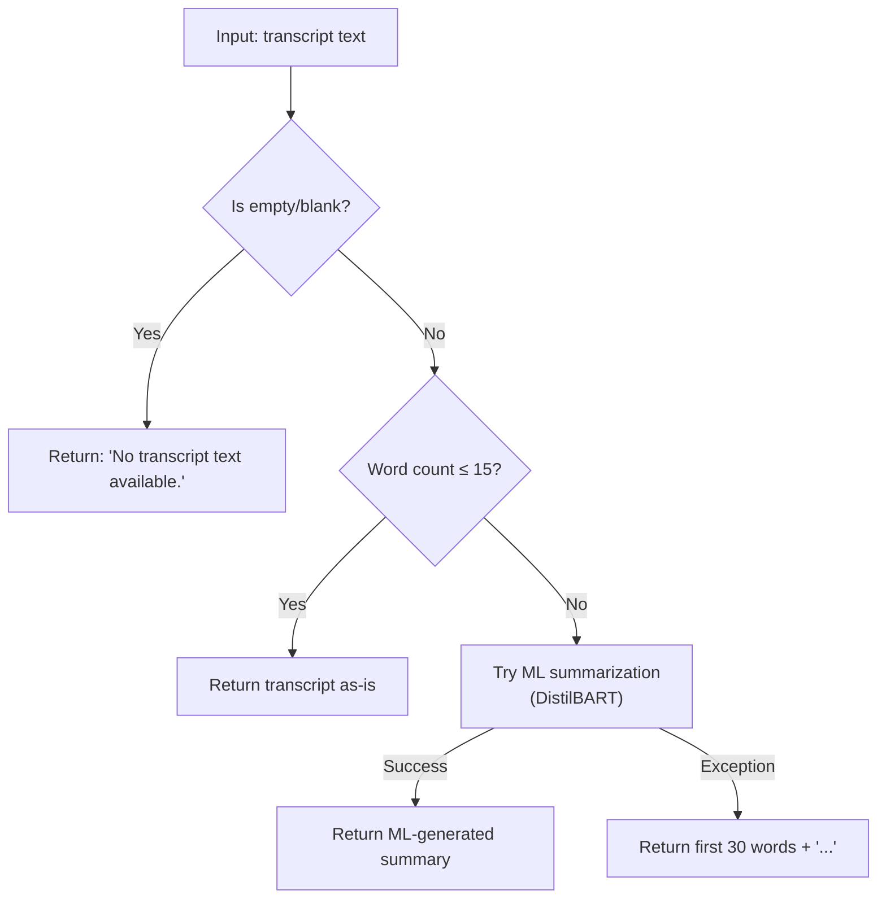
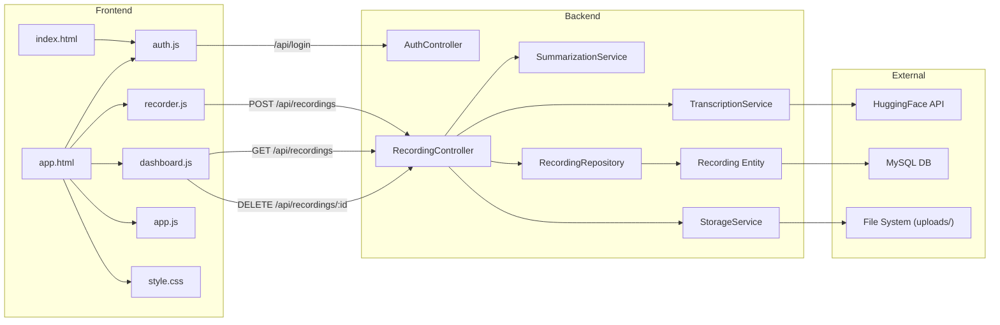

# EchoArchive — Full Project Analysis

## 1. Project Overview

**EchoArchive** is a fullstack web application that lets users **record voice audio** in the browser, **transcribe** it using the OpenAI Whisper model via the HuggingFace Inference API, and **summarize** the transcript using an extractive summarization algorithm — all persisted to a MySQL database.

| Layer | Technology |
|-------|-----------|
| Backend Framework | Spring Boot 3.2.3 (Java 21) |
| Database | MySQL (`echoarchive` schema) |
| ORM | Spring Data JPA / Hibernate |
| Transcription | HuggingFace Inference API (Whisper Large V3 Turbo) |
| Summarization | Pure-Java extractive algorithm (+ optional Python ML script) |
| Frontend | Vanilla HTML/JS with TailwindCSS CDN |
| Build System | Maven (`pom.xml`) |

---

## 2. High-Level Architecture



### Request Flow (Recording Upload)

1. User records audio in the browser via `MediaRecorder` API
2. Browser POSTs the `.webm` blob to `POST /api/recordings`
3. **StorageService** saves the file to the `uploads/` directory
4. **TranscriptionService** sends the audio bytes to HuggingFace's Whisper model and returns the transcript text
5. **SummarizationService** condenses the transcript into a summary
6. A `Recording` entity is saved to MySQL with filename, username, transcript, and summary
7. The response (including transcript + summary) is returned to the browser
8. The dashboard renders the recording card with playback, transcript toggle, and summary

---

## 3. File-by-File Breakdown

### 3.1 Build & Configuration

#### [pom.xml](file:///Users/atharvgautamghosh/Documents/atharv2/voice-app/server/pom.xml)
Maven project descriptor. Defines the project as `com.voiceapp:voice-app-server:1.0.0` with Spring Boot 3.2.3 as the parent POM. Dependencies:
- `spring-boot-starter-web` — REST controllers, embedded Tomcat
- `spring-boot-starter-data-jpa` — JPA/Hibernate ORM
- `mysql-connector-j` — MySQL JDBC driver (runtime scope)
- `spring-boot-starter-test` — testing (test scope)

Uses Java 21 and the Spring Boot Maven plugin for packaging.

#### [application.properties](file:///Users/atharvgautamghosh/Documents/atharv2/voice-app/server/src/main/resources/application.properties)
Runtime configuration:
- **Server port**: `5000`
- **MySQL connection**: `jdbc:mysql://localhost:3306/echoarchive` (root user, no password)
- **JPA**: `ddl-auto=update` (auto-creates/modifies tables)
- **File uploads**: max 50 MB per file/request
- **Admin credentials**: `admin` / `Apsit@1234`
- **HuggingFace API token**: stored as `hf.api.token`

---

### 3.2 Java Backend (Spring Boot)

#### [VoiceAppApplication.java](file:///Users/atharvgautamghosh/Documents/atharv2/voice-app/server/src/main/java/com/voiceapp/VoiceAppApplication.java)
The Spring Boot entry point. Contains the standard `main()` method that bootstraps the entire application via `SpringApplication.run()`. The `@SpringBootApplication` annotation enables auto-configuration, component scanning, and configuration.

---

#### [WebConfig.java](file:///Users/atharvgautamghosh/Documents/atharv2/voice-app/server/src/main/java/com/voiceapp/config/WebConfig.java)
Spring MVC configuration class:
- **CORS**: Allows all origins (`*`) with GET, POST, PUT, DELETE, OPTIONS methods — enables frontend-backend communication during development.
- **Static resource handler**: Maps `/uploads/**` URL paths to the physical `uploads/` directory on disk, so audio files can be played back directly from the browser.

---

#### [AuthController.java](file:///Users/atharvgautamghosh/Documents/atharv2/voice-app/server/src/main/java/com/voiceapp/controller/AuthController.java)
REST controller at `/api/login`. Implements simple credential-based authentication:
- Reads `admin.username` and `admin.password` from `application.properties` using `@Value`
- Compares the incoming JSON body (`username`, `password`) against the configured values
- Returns `{"success": true, "user": "admin"}` on match, or `{"success": false, "error": "Invalid credentials"}` on failure
- **No session/JWT management** — authentication state is stored client-side in `sessionStorage`

---

#### [RecordingController.java](file:///Users/atharvgautamghosh/Documents/atharv2/voice-app/server/src/main/java/com/voiceapp/controller/RecordingController.java)
The core REST controller at `/api/recordings` with three endpoints:

| Method | Path | Purpose |
|--------|------|---------|
| `POST` | `/api/recordings` | Upload audio → Transcribe → Summarize → Save |
| `GET` | `/api/recordings` | List all recordings (newest first) |
| `DELETE` | `/api/recordings/{id}` | Delete a recording (file + DB record) |

The upload flow is the heart of the application — it orchestrates the three services (Storage → Transcription → Summarization) in sequence.

---

#### [Recording.java](file:///Users/atharvgautamghosh/Documents/atharv2/voice-app/server/src/main/java/com/voiceapp/entity/Recording.java)
JPA entity mapped to the `recordings` table:

| Column | Type | Notes |
|--------|------|-------|
| `id` | `Long` | Auto-generated primary key |
| `filename` | `String` | Stored filename (e.g., `1784966209954-recording.webm`) |
| `username` | `String` | Who recorded it |
| `transcript` | `TEXT` | Full Whisper transcription |
| `summary` | `TEXT` | Extractive summary |
| `createdAt` | `LocalDateTime` | Auto-set on construction |

---

#### [RecordingRepository.java](file:///Users/atharvgautamghosh/Documents/atharv2/voice-app/server/src/main/java/com/voiceapp/repository/RecordingRepository.java)
Spring Data JPA repository interface. Extends `JpaRepository<Recording, Long>` providing full CRUD. Adds one custom query method:
- `findAllByOrderByCreatedAtDesc()` — returns recordings sorted newest-first (Spring Data derives the SQL from the method name).

---

#### [StorageService.java](file:///Users/atharvgautamghosh/Documents/atharv2/voice-app/server/src/main/java/com/voiceapp/service/StorageService.java)
File storage abstraction:
- Constructor creates the `uploads/` directory if it doesn't exist
- `store(file, name)` — copies the uploaded multipart file to disk with the given filename
- `delete(filename)` — removes a file from the uploads directory
- `getUploadPath()` — returns the absolute path to the uploads directory

---

#### [TranscriptionService.java](file:///Users/atharvgautamghosh/Documents/atharv2/voice-app/server/src/main/java/com/voiceapp/service/TranscriptionService.java)
Speech-to-text service using the HuggingFace Inference API:
- Sends raw audio bytes via HTTP POST to `https://router.huggingface.co/hf-inference/models/openai/whisper-large-v3-turbo`
- Authenticates with a Bearer token from `hf.api.token`
- Determines the `Content-Type` header based on file extension (`.wav`, `.mp3`, `.m4a`, or default `.webm`)
- Parses the JSON response and extracts the `text` field
- Uses Java's built-in `HttpClient` with a 30s connect timeout and 60s request timeout

---

#### [SummarizationService.java](file:///Users/atharvgautamghosh/Documents/atharv2/voice-app/server/src/main/java/com/voiceapp/service/SummarizationService.java)
Pure-Java text summarization using frequency-based extractive summarization. This is the **production summarization engine** used by the server (as opposed to the Python script). Detailed analysis in [Section 4](#4-deep-dive-summarisepy) below.

The algorithm:
1. **Empty guard**: null/blank → `"No transcript text available."`
2. **Short text** (≤ 15 words): return as-is
3. **Extractive summarization**: Split into sentences → score by word frequency (TF) → select top ⅓ sentences → reassemble in original order
4. **Fallback**: first 30 words + `"..."`

---

### 3.3 Python Script

#### [summarise.py](file:///Users/atharvgautamghosh/Documents/atharv2/voice-app/server/scripts/summarise.py)
A standalone Python script for **ML-powered abstractive summarization**. Full deep-dive in [Section 4](#4-deep-dive-summarisepy) below.

---

### 3.4 Frontend

#### [index.html](file:///Users/atharvgautamghosh/Documents/atharv2/voice-app/server/src/main/resources/static/index.html)
The login page. Features a glassmorphism card with animated floating orbs, mesh gradient background, and a dark theme. On form submission:
1. POSTs credentials to `/api/login`
2. On success, stores the username in `sessionStorage` and redirects to `app.html`
3. On failure, shows a shake-animated error badge

All styling is inline (custom CSS properties + TailwindCSS CDN). Uses Inter + Space Grotesk fonts.

---

#### [app.html](file:///Users/atharvgautamghosh/Documents/atharv2/voice-app/server/src/main/resources/static/app.html)
The main application page with two tabbed views:

- **Studio View**: Contains the recording interface — a large record button, waveform visualization, timer, and preview/upload controls
- **Dashboard View**: Shows all saved recordings with search, playback, transcript toggle, and delete functionality

Includes a responsive navbar with user display and logout button. Loads four JS modules: `auth.js`, `recorder.js`, `dashboard.js`, `app.js`.

---

#### [style.css](file:///Users/atharvgautamghosh/Documents/atharv2/voice-app/server/src/main/resources/static/css/style.css)
The design system (558 lines) defining:
- CSS custom properties (colors, fonts, radii, transitions)
- Global reset
- Animated mesh background and floating orbs
- Glassmorphism panels (`.glass`, `.glass-card`)
- Record button states (start/stop with pulse animation)
- Timer display with gradient text
- Waveform bar animations
- Status badges (info, success, danger, warning)
- Recording card styles with summary block
- Transcript toggle
- Custom scrollbar
- Fade-up animations

---

#### [auth.js](file:///Users/atharvgautamghosh/Documents/atharv2/voice-app/server/src/main/resources/static/js/auth.js)
Authentication utility module (`window.Auth`):
- `login(username, password)` — POSTs to `/api/login` and returns the JSON response
- `logout()` — clears `sessionStorage` and redirects to `index.html`
- `getUser()` — reads the stored username from `sessionStorage`
- `requireAuth()` — redirects to login page if no user is stored

---

#### [recorder.js](file:///Users/atharvgautamghosh/Documents/atharv2/voice-app/server/src/main/resources/static/js/recorder.js)
Voice recording module (`window.Recorder`):
- Uses the browser `MediaRecorder` API to capture audio from the microphone
- Records chunks into an array, then assembles a `Blob` on stop
- Manages a timer interval (seconds counter)
- Shows a preview `<audio>` element after recording
- On "Upload & Analyze": POSTs the blob as `FormData` to `/api/recordings`, then refreshes the dashboard
- "Discard" cleans up the blob and resets the UI
- Handles UI state transitions (button styles, waveform animation, status badge colors)

---

#### [dashboard.js](file:///Users/atharvgautamghosh/Documents/atharv2/voice-app/server/src/main/resources/static/js/dashboard.js)
Recordings dashboard module (`window.Dashboard`):
- `fetchRecordings()` — GETs from `/api/recordings` and renders cards
- `deleteRecording(id)` — DELETEs via `/api/recordings/{id}` with confirmation
- `renderRecordings()` — creates DOM cards with filename, username, date/time, summary block, expandable transcript, audio player, and delete button. Cards animate in with staggered fade-up.
- `toggleTranscript(id)` — expands/collapses the full transcript with arrow rotation
- `search(query)` — client-side filtering across filename, transcript, and summary fields

---

#### [app.js](file:///Users/atharvgautamghosh/Documents/atharv2/voice-app/server/src/main/resources/static/js/app.js)
Application bootstrap module:
- On `DOMContentLoaded`: checks auth, displays user info, initializes Recorder and Dashboard, sets default view to "studio"
- `switchView(view)` — toggles between studio and dashboard views, swapping CSS classes for active/inactive tabs (both desktop and mobile)
- `logout()` — delegates to `window.Auth.logout()`

---

### 3.5 Uploads Directory

#### [uploads/](file:///Users/atharvgautamghosh/Documents/atharv2/voice-app/server/uploads)
Contains the raw audio recordings saved by `StorageService`. Currently has two `.webm` files (≈1.1 MB and ≈87 KB). Files are served statically via the resource handler configured in `WebConfig`.

---

## 4. Deep Dive: `summarise.py`

> [!NOTE]
> Path: [summarise.py](file:///Users/atharvgautamghosh/Documents/atharv2/voice-app/server/scripts/summarise.py) — 33 lines of Python

### 4.1 Purpose & Role in the Project

`summarise.py` is an **alternative summarization engine** that uses a pre-trained deep learning model (`sshleifer/distilbart-cnn-12-6`) from the Hugging Face Transformers library to perform **abstractive summarization** — generating new, concise text that captures the meaning of the input.

It lives in the `scripts/` directory and is designed to be invoked as an **external process** from the Java backend. The Java [SummarizationService](file:///Users/atharvgautamghosh/Documents/atharv2/voice-app/server/src/main/java/com/voiceapp/service/SummarizationService.java) mirrors the same threshold logic but uses a simpler extractive algorithm instead, because spawning a Python process per request is too slow for production use.

### 4.2 How It Can Be Invoked

The script supports two input methods:

```bash
# Method 1: Command-line argument
python3 summarise.py "Your transcript text goes here..."

# Method 2: Standard input (pipe)
echo "Your transcript text goes here..." | python3 summarise.py
```

Output is always a **JSON object** printed to stdout:
```json
{"summary": "The condensed summary text..."}
```

### 4.3 Line-by-Line Code Analysis

```python
#!/usr/bin/env python3          # Shebang — run with python3
import sys, json                # sys for CLI args/stdin, json for output
```

#### The `main()` Function

**Step 1 — Input Acquisition (lines 5–8)**
```python
if len(sys.argv) > 1 and sys.argv[1]:
    transcript = sys.argv[1]     # Prefer CLI argument
else:
    transcript = sys.stdin.read() # Fall back to stdin
```
Checks for a command-line argument first; if none is provided, reads the full contents of stdin. This dual-mode design allows the script to be called either directly or via pipe.

**Step 2 — Empty Input Guard (lines 10–13)**
```python
transcript = transcript.strip()
if not transcript:
    print(json.dumps({"summary": "No transcript text available."}))
    return
```
Strips whitespace and returns a default message if the input is empty. This prevents the ML model from processing blank input.

**Step 3 — Short Text Bypass (lines 15–18)**
```python
words = transcript.split()
if len(words) <= 15:
    print(json.dumps({"summary": transcript}))
    return
```
If the transcript is 15 words or fewer, it's already short enough — return it verbatim as its own summary. This threshold matches the Java `SummarizationService.SHORT_TEXT_THRESHOLD` constant exactly.

**Step 4 — ML-Powered Abstractive Summarization (lines 20–26)**
```python
from transformers import pipeline
summariser = pipeline('summarization', model='sshleifer/distilbart-cnn-12-6')
max_len = min(80, max(20, len(words)))
min_len = min(20, max(5, len(words) // 2))
summary = summariser(transcript, max_length=max_len, min_length=min_len,
                     do_sample=False)[0]['summary_text']
print(json.dumps({"summary": summary}))
```

| Detail | Explanation |
|--------|-------------|
| **Lazy import** | `from transformers import pipeline` is inside the `try` block — only loaded when needed, allowing the script to fail gracefully if the library isn't installed |
| **Model** | `sshleifer/distilbart-cnn-12-6` is a distilled version of BART fine-tuned on CNN/DailyMail, optimized for news-style summarization |
| **`max_length`** | Capped at 80 tokens, but dynamically scales down to `max(20, word_count)` for shorter inputs |
| **`min_length`** | Set to `min(20, word_count // 2)` — ensures the summary is at least half the input length (up to 20 tokens) |
| **`do_sample=False`** | Uses greedy decoding (deterministic output, no randomness) |
| **Output extraction** | The pipeline returns a list of dicts; `[0]['summary_text']` gets the first result's summary text |

**Step 5 — Fallback on Failure (lines 27–29)**
```python
except Exception as e:
    fallback = " ".join(words[:30]) + ("..." if len(words) > 30 else "")
    print(json.dumps({"summary": fallback}))
```
If the ML model fails (missing library, out of memory, model download error, etc.), the script falls back to returning the **first 30 words** of the transcript with an ellipsis. This matches the Java `SummarizationService.buildFallback()` method exactly.

### 4.4 Decision Flow Diagram



### 4.5 Relationship to `SummarizationService.java`

The Python script and the Java service implement the **same 4-step decision logic** with identical thresholds:

| Step | Python (`summarise.py`) | Java (`SummarizationService`) |
|------|------------------------|-------------------------------|
| Empty guard | `"No transcript text available."` | `"No transcript text available."` |
| Short text threshold | `len(words) <= 15` | `words.length <= 15` |
| Summarization method | **Abstractive** (DistilBART ML model) | **Extractive** (TF-based sentence scoring) |
| Fallback | First 30 words + `"..."` | First 30 words + `"..."` |

> [!IMPORTANT]
> The Java service is the **active production code** used by the running server. The Python script serves as a reference implementation / offline tool that provides higher-quality ML-powered summaries but is too slow for real-time use (model loading + inference per request).

### 4.6 Dependencies

To run the Python script independently, you need:

```bash
pip install transformers torch
```

The `sshleifer/distilbart-cnn-12-6` model will be downloaded automatically on first use (~1.2 GB).

---

## 5. Inter-File Interaction Map



---

## 6. Summary

EchoArchive is a cleanly layered application with a clear separation of concerns:

- **Frontend**: Handles recording, playback, and display using vanilla JS modules
- **Controllers**: Thin REST endpoints that orchestrate service calls
- **Services**: Each service has a single responsibility (storage, transcription, summarization)
- **Data layer**: JPA entity + repository for persistence
- **Scripts**: The Python `summarise.py` provides an ML-powered alternative summarizer

The `summarise.py` script is the ML-quality counterpart to the Java summarization service — sharing the same behavioral contract (thresholds, fallbacks, output format) but using a deep learning model for higher-quality abstractive summaries when invoked offline.
