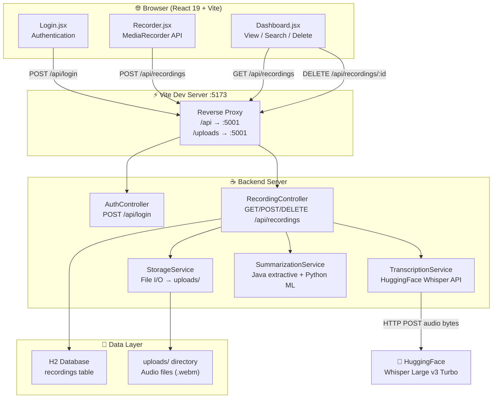
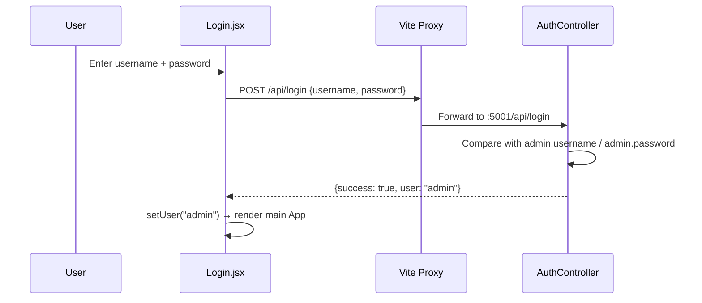
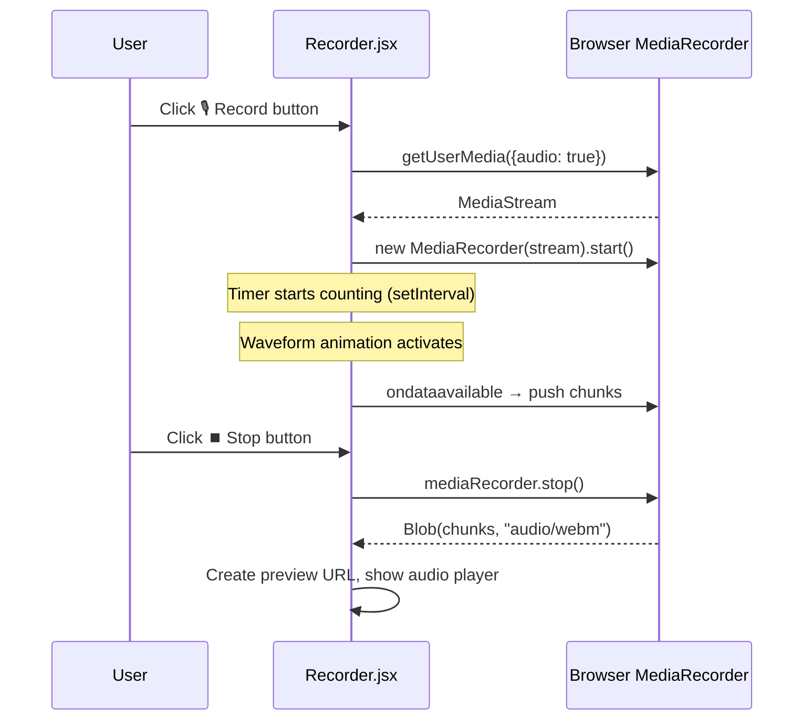
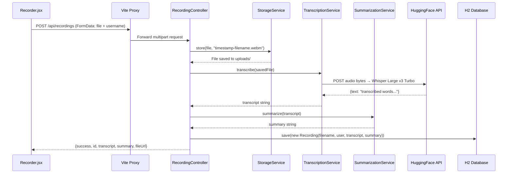
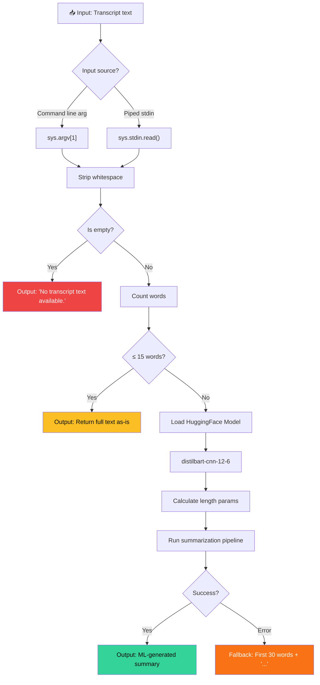

# EchoArchive — Complete Project Walkthrough

> **AI-powered Voice Recording, Transcription & Summarization Platform**
> Built with React 19 + Vite (frontend) and Spring Boot 3 / Java 21 (backend)

---

## 🏗️ Architecture Overview



---

## 📂 Project Structure & File Map

```
voice-app/
├── client/                          # React Frontend
│   ├── index.html                   # HTML entry point
│   ├── package.json                 # Dependencies & scripts
│   ├── vite.config.js               # Vite config + API proxy
│   └── src/
│       ├── main.jsx                 # App root + ReactDOM mount
│       ├── App.jsx                  # Alternate App component (unused)
│       ├── index.css                # Full design system (glassmorphism)
│       ├── App.css                  # Vite boilerplate styles (unused)
│       └── components/
│           ├── Login.jsx            # Auth form
│           ├── Recorder.jsx         # Audio capture + upload
│           └── Dashboard.jsx        # Recordings list + search
│
└── server/                          # Java/Node Backend
    ├── pom.xml                      # Maven build config (Spring Boot)
    ├── server.js                    # Node.js fallback server
    ├── scripts/
    │   └── summarise.py             # Python ML summarizer
    ├── db/
    │   └── recordings.json          # Node server's JSON database
    ├── uploads/                     # Stored audio files
    └── src/main/
        ├── resources/
        │   └── application.properties   # Spring config
        └── java/com/voiceapp/
            ├── VoiceAppApplication.java # Spring Boot entry
            ├── config/
            │   └── WebConfig.java       # CORS + static files
            ├── controller/
            │   ├── AuthController.java  # Login endpoint
            │   └── RecordingController.java  # CRUD recordings
            ├── entity/
            │   └── Recording.java       # JPA entity
            ├── repository/
            │   └── RecordingRepository.java  # Data access
            └── service/
                ├── StorageService.java       # File storage
                ├── TranscriptionService.java # Whisper API
                └── SummarizationService.java # Text summarizer
```

---

## 🔄 How It Works — End-to-End Data Flow

### 1. User Opens the App
```
Browser → http://localhost:5173 → Vite serves index.html → main.jsx renders <Login />
```

### 2. Authentication


### 3. Recording Audio


### 4. Upload & AI Processing


### 5. Dashboard — View Recordings
```
Dashboard.jsx → GET /api/recordings → Vite Proxy → RecordingController
→ RecordingRepository.findAllByOrderByCreatedAtDesc() → H2 Database
→ JSON response → Dashboard renders RecordingCards with search/filter
```

---

## 📄 File-by-File Breakdown

---

### Frontend Files

---

#### [index.html](file:///Users/atharvgautamghosh/Documents/atharv2/voice-app/client/index.html)
**Role:** HTML entry point

| Aspect | Detail |
|--------|--------|
| **Fonts** | Loads Google Fonts: **Inter** (body) and **Space Grotesk** (headings) |
| **SEO** | Title: "EchoArchive — AI Voice Recorder & Transcriber", meta description included |
| **Mount** | `<div id="root">` — React mounts here via `main.jsx` |

---

#### [package.json](file:///Users/atharvgautamghosh/Documents/atharv2/voice-app/client/package.json)
**Role:** NPM package configuration

| Dependency | Version | Purpose |
|-----------|---------|---------|
| `react` | ^19.2.7 | UI framework |
| `react-dom` | ^19.2.7 | DOM rendering |
| `axios` | ^1.18.1 | HTTP client for API calls |
| `vite` | ^8.1.1 | Build tool + dev server |
| `@vitejs/plugin-react` | ^6.0.3 | React Fast Refresh / JSX transform |

---

#### [vite.config.js](file:///Users/atharvgautamghosh/Documents/atharv2/voice-app/client/vite.config.js)
**Role:** Vite build & dev server configuration

- **Dev Server Port:** `5173`
- **Proxy Rules:**
  - `/api/*` → `http://localhost:5001` (backend API)
  - `/uploads/*` → `http://localhost:5001` (audio file serving)
- This proxy eliminates CORS issues during development

---

#### [main.jsx](file:///Users/atharvgautamghosh/Documents/atharv2/voice-app/client/src/main.jsx)
**Role:** Application root — the **actual** entry point rendered by React

This is the **primary App component** (not `App.jsx`). It handles:

- **Auth state:** `useState(null)` — if `user` is null, shows `<Login />`
- **View switching:** `useState("recorder")` toggles between Studio and Recordings
- **Layout:** Ambient orbs + glassmorphic navbar + main content + footer
- **Navbar:** Brand logo, tab buttons (Studio / Recordings), user avatar chip, sign-out button
- **ReactDOM mount:** `createRoot(#root).render(<App />)` in StrictMode

---

#### [App.jsx](file:///Users/atharvgautamghosh/Documents/atharv2/voice-app/client/src/App.jsx)
**Role:** Alternate / simplified App component

> [!NOTE]
> This file is **not actively used** — `main.jsx` defines its own inline `App` component with the full glassmorphic UI. This file exists as a simpler version but is never imported.

---

#### [index.css](file:///Users/atharvgautamghosh/Documents/atharv2/voice-app/client/src/index.css)
**Role:** Complete design system — **the most important styling file**

| Section | What It Does |
|---------|-------------|
| **CSS Variables** | 50+ design tokens: colors, glass effects, shadows, typography, radius, transitions |
| **Reset** | Box-sizing, smooth scroll, antialiased fonts |
| **Mesh Background** | `body::before` with 4 layered radial gradients + `meshShift` animation |
| **Floating Orbs** | 3 blurred circles (`.orb-1/2/3`) with `orbFloat` animation |
| **Glass Panels** | `.glass` and `.glass-card` with backdrop-filter blur, gradient borders |
| **Buttons** | `.btn-primary` (gradient), `.btn-danger`, `.btn-ghost`, `.btn-icon` |
| **Badges** | `.badge-info/success/danger/warning` with pulsing dot animation |
| **Record Button** | Large circular button with `pulseRecord` animation when recording |
| **Timer** | Gradient text with Space Grotesk monospace font |
| **Waveform** | 7 animated bars with `waveAnim` keyframes |
| **Audio Player** | Custom-styled with CSS filter inversion |
| **Login Page** | Centered card with logo, form inputs, glassmorphism |
| **Utilities** | Flexbox, spacing, text helpers, fade-up animations |

---

#### [Login.jsx](file:///Users/atharvgautamghosh/Documents/atharv2/voice-app/client/src/components/Login.jsx)
**Role:** Authentication form component

- Renders a glassmorphic login card with ambient orbs
- Two form fields: username + password
- On submit: `POST /api/login` via Axios
- On success: calls `onLogin(res.data.user)` → parent shows main app
- On error: shows a danger badge with pulsing dot
- Loading state: spinner + "Authenticating…" text

---

#### [Recorder.jsx](file:///Users/atharvgautamghosh/Documents/atharv2/voice-app/client/src/components/Recorder.jsx)
**Role:** Audio recording & upload component

| Feature | Implementation |
|---------|---------------|
| **Mic Access** | `navigator.mediaDevices.getUserMedia({audio: true})` |
| **Recording** | `MediaRecorder` API, collects chunks via `ondataavailable` |
| **Timer** | `setInterval` counting seconds, formatted as `MM:SS` |
| **Waveform** | 7 animated CSS bars (active when recording) |
| **Preview** | `URL.createObjectURL(blob)` → `<audio>` player |
| **Upload** | `FormData` with blob + username → `POST /api/recordings` |
| **Discard** | Clears blob, URL, timer — resets to ready state |
| **Status Badges** | Dynamic: "Ready", "Recording…", "Transcribing…", "Saved!" |

---

#### [Dashboard.jsx](file:///Users/atharvgautamghosh/Documents/atharv2/voice-app/client/src/components/Dashboard.jsx)
**Role:** Recordings list, search, and management

| Feature | Implementation |
|---------|---------------|
| **Fetch** | `GET /api/recordings` on mount via `useEffect` |
| **Search** | Client-side filter across filename, transcript, summary |
| **RecordingCard** | Shows filename, username badge, date/time, AI summary block |
| **Transcript** | Expandable section with rotate arrow toggle |
| **Audio Playback** | `<audio controls>` with server file URL |
| **Delete** | `DELETE /api/recordings/:id` with confirmation dialog |
| **Empty State** | Mic icon with contextual message |
| **Refresh** | Manual re-fetch button in toolbar |

---

### Backend Files (Spring Boot / Java)

---

#### [pom.xml](file:///Users/atharvgautamghosh/Documents/atharv2/voice-app/server/pom.xml)
**Role:** Maven build configuration

| Config | Value |
|--------|-------|
| **Java** | 21 |
| **Spring Boot** | 3.2.3 |
| **Dependencies** | spring-boot-starter-web, spring-boot-starter-data-jpa, H2 database, spring-boot-starter-test |
| **Build Plugin** | spring-boot-maven-plugin (creates runnable JAR) |

---

#### [application.properties](file:///Users/atharvgautamghosh/Documents/atharv2/voice-app/server/src/main/resources/application.properties)
**Role:** Spring Boot configuration

| Property | Value | Purpose |
|----------|-------|---------|
| `server.port` | 5000 | Backend HTTP port |
| `spring.datasource.url` | `jdbc:h2:file:./db/recordingsdb` | File-based H2 database |
| `spring.jpa.hibernate.ddl-auto` | `update` | Auto-create/update tables |
| `spring.h2.console.enabled` | `true` | Web DB console at `/h2-console` |
| `spring.servlet.multipart.max-file-size` | `50MB` | Max upload size |
| `admin.username` | `admin` | Login credential |
| `admin.password` | `Apsit@1234` | Login credential |
| `hf.api.token` | `hf_hbW...` | HuggingFace API key for Whisper |

> [!WARNING]
> The HuggingFace API token and admin password are stored in plain text. In production, use environment variables or a secrets manager.

---

#### [VoiceAppApplication.java](file:///Users/atharvgautamghosh/Documents/atharv2/voice-app/server/src/main/java/com/voiceapp/VoiceAppApplication.java)
**Role:** Spring Boot entry point — `@SpringBootApplication` + `main()`

---

#### [WebConfig.java](file:///Users/atharvgautamghosh/Documents/atharv2/voice-app/server/src/main/java/com/voiceapp/config/WebConfig.java)
**Role:** Web MVC configuration

- **CORS:** Allows all origins (`*`) and methods (GET, POST, PUT, DELETE, OPTIONS)
- **Static Resources:** Maps `/uploads/**` URL pattern to the physical `uploads/` directory on disk

---

#### [AuthController.java](file:///Users/atharvgautamghosh/Documents/atharv2/voice-app/server/src/main/java/com/voiceapp/controller/AuthController.java)
**Role:** `POST /api/login` endpoint

- Reads `admin.username` and `admin.password` from `application.properties` via `@Value`
- Compares submitted credentials against stored values
- Returns `{success: true, user: "admin"}` or `{success: false, error: "Invalid credentials"}`

---

#### [RecordingController.java](file:///Users/atharvgautamghosh/Documents/atharv2/voice-app/server/src/main/java/com/voiceapp/controller/RecordingController.java)
**Role:** Main REST controller — the **heart of the backend**

| Endpoint | Method | What It Does |
|----------|--------|-------------|
| `/api/recordings` | `POST` | 1) Save file via `StorageService` 2) Transcribe via `TranscriptionService` → Whisper 3) Summarize via `SummarizationService` 4) Save to H2 DB |
| `/api/recordings` | `GET` | Fetch all recordings ordered by `createdAt DESC` |
| `/api/recordings/{id}` | `DELETE` | Delete file from disk + delete row from DB |

---

#### [Recording.java](file:///Users/atharvgautamghosh/Documents/atharv2/voice-app/server/src/main/java/com/voiceapp/entity/Recording.java)
**Role:** JPA Entity → `recordings` table

| Column | Type | Notes |
|--------|------|-------|
| `id` | `Long` | Auto-generated primary key |
| `filename` | `String` | Stored filename on disk |
| `username` | `String` | Who recorded it |
| `transcript` | `TEXT` | Full Whisper transcript |
| `summary` | `TEXT` | AI-generated summary |
| `createdAt` | `LocalDateTime` | Auto-set in constructor |

---

#### [RecordingRepository.java](file:///Users/atharvgautamghosh/Documents/atharv2/voice-app/server/src/main/java/com/voiceapp/repository/RecordingRepository.java)
**Role:** Spring Data JPA Repository

- Extends `JpaRepository<Recording, Long>` — provides free CRUD operations
- Custom method: `findAllByOrderByCreatedAtDesc()` — newest recordings first

---

#### [StorageService.java](file:///Users/atharvgautamghosh/Documents/atharv2/voice-app/server/src/main/java/com/voiceapp/service/StorageService.java)
**Role:** File system operations for audio files

| Method | What It Does |
|--------|-------------|
| **Constructor** | Creates `uploads/` directory if missing |
| `store(file, name)` | Copies `MultipartFile` input stream to `uploads/{name}` |
| `delete(filename)` | Deletes file from `uploads/` |

---

#### [TranscriptionService.java](file:///Users/atharvgautamghosh/Documents/atharv2/voice-app/server/src/main/java/com/voiceapp/service/TranscriptionService.java)
**Role:** Speech-to-text via HuggingFace Inference API

- **Model:** `openai/whisper-large-v3-turbo` via HuggingFace Router
- **Process:** Reads raw audio bytes → sends HTTP POST with `Authorization: Bearer` token → parses JSON response `{text: "..."}` → returns transcript string
- **Timeout:** 30s connect, 60s request
- **Content-Type detection:** `.wav` → `audio/wav`, `.mp3` → `audio/mpeg`, default → `audio/webm`

---

#### [SummarizationService.java](file:///Users/atharvgautamghosh/Documents/atharv2/voice-app/server/src/main/java/com/voiceapp/service/SummarizationService.java)
**Role:** Pure-Java extractive text summarization (mirrors `summarise.py` logic)

This is the Java-native replacement for the Python ML pipeline. Covered in detail in the next section.

---

#### [server.js](file:///Users/atharvgautamghosh/Documents/atharv2/voice-app/server/server.js)
**Role:** Node.js fallback/mock server (used when Java/Maven isn't available)

- Runs on port `5001` with zero dependencies
- Implements the same API endpoints as the Spring Boot server
- Uses `db/recordings.json` as a flat-file database instead of H2
- **Mock transcription:** Returns random sample transcripts instead of calling Whisper
- Handles multipart form parsing manually (no library)

---

## 🧠 Deep Dive: `summarise.py` — The AI Summarization Script

### File Location
[summarise.py](file:///Users/atharvgautamghosh/Documents/atharv2/voice-app/server/scripts/summarise.py)

### Purpose
This Python script is the **ML-powered text summarization engine** for EchoArchive. It takes a transcript (speech-to-text output from Whisper) and produces a concise summary using a pre-trained neural network model.

### Complete Source Code

```python
#!/usr/bin/env python3
import sys, json

def main():
    if len(sys.argv) > 1 and sys.argv[1]:
        transcript = sys.argv[1]
    else:
        transcript = sys.stdin.read()

    transcript = transcript.strip()
    if not transcript:
        print(json.dumps({"summary": "No transcript text available."}))
        return

    words = transcript.split()
    if len(words) <= 15:
        print(json.dumps({"summary": transcript}))
        return

    try:
        from transformers import pipeline
        summariser = pipeline('summarization', model='sshleifer/distilbart-cnn-12-6')
        max_len = min(80, max(20, len(words)))
        min_len = min(20, max(5, len(words) // 2))
        summary = summariser(transcript, max_length=max_len, min_length=min_len, do_sample=False)[0]['summary_text']
        print(json.dumps({"summary": summary}))
    except Exception as e:
        fallback = " ".join(words[:30]) + ("..." if len(words) > 30 else "")
        print(json.dumps({"summary": fallback}))

if __name__ == "__main__":
    main()
```

---

### How It Works — Step by Step



---

### Input Handling (Lines 4–8)

```python
if len(sys.argv) > 1 and sys.argv[1]:
    transcript = sys.argv[1]
else:
    transcript = sys.stdin.read()
```

The script accepts input in **two ways:**

| Method | Usage Example | When Used |
|--------|--------------|-----------|
| **Command-line argument** | `python summarise.py "Hello world..."` | Direct invocation from Java's `ProcessBuilder` |
| **Standard input (pipe)** | `echo "Hello world..." \| python summarise.py` | Piped invocation from shell scripts |

This dual-input design makes the script flexible — it can be called from Java code, shell scripts, or even manually from the terminal.

---

### Guard Clauses (Lines 10–17)

#### Empty Text Guard
```python
transcript = transcript.strip()
if not transcript:
    print(json.dumps({"summary": "No transcript text available."}))
    return
```
If the Whisper transcription returned nothing (empty recording, silence, or error), the script outputs a default message rather than crashing.

#### Short Text Guard
```python
words = transcript.split()
if len(words) <= 15:
    print(json.dumps({"summary": transcript}))
    return
```
If the transcript is **15 words or fewer**, there's nothing meaningful to summarize — the full text IS the summary. This avoids wasting GPU/CPU cycles on trivially short inputs.

> [!TIP]
> The threshold of 15 words is mirrored exactly in the Java `SummarizationService.java` (`SHORT_TEXT_THRESHOLD = 15`) to ensure consistent behavior regardless of which backend is running.

---

### The ML Summarization Engine (Lines 19–26)

```python
from transformers import pipeline
summariser = pipeline('summarization', model='sshleifer/distilbart-cnn-12-6')
max_len = min(80, max(20, len(words)))
min_len = min(20, max(5, len(words) // 2))
summary = summariser(transcript, max_length=max_len, min_length=min_len, do_sample=False)[0]['summary_text']
```

#### The Model: `sshleifer/distilbart-cnn-12-6`

| Property | Detail |
|----------|--------|
| **Architecture** | DistilBART — a distilled (compressed) version of Facebook's BART |
| **Base Model** | BART-Large (facebook/bart-large-cnn) |
| **Training Data** | CNN/DailyMail news article dataset |
| **Parameters** | ~306M (vs 400M+ for full BART-Large) |
| **Layers** | 12 encoder + 6 decoder (vs 12+12 in full model) |
| **Task** | Abstractive text summarization |
| **Speed** | ~2x faster than full BART-Large with minimal quality loss |

#### Why This Model?
- **Abstractive** (not extractive): It generates *new sentences* that capture the meaning, rather than just picking existing sentences
- **Distilled**: Smaller and faster than the full BART model — important for a web app where users wait for results
- **Pre-trained on news**: Good at extracting key points from spoken content (transcripts resemble informal articles)

#### Length Parameters Explained

```python
max_len = min(80, max(20, len(words)))  # Caps at 80 tokens, floor at 20
min_len = min(20, max(5, len(words) // 2))  # Caps at 20 tokens, floor at 5
```

These are **adaptive** based on input length:

| Input Length | max_len | min_len | Effect |
|-------------|---------|---------|--------|
| 20 words | 20 | 10 | Very concise summary |
| 40 words | 40 | 20 | Medium summary |
| 100 words | 80 | 20 | Capped — won't exceed 80 tokens |
| 200 words | 80 | 20 | Same caps for very long transcripts |

#### `do_sample=False`
This tells the model to use **greedy decoding** (always pick the most probable next word) rather than random sampling. This makes summaries **deterministic** — the same input always produces the same output.

---

### Fallback Mechanism (Lines 27–29)

```python
except Exception as e:
    fallback = " ".join(words[:30]) + ("..." if len(words) > 30 else "")
    print(json.dumps({"summary": fallback}))
```

If the ML model fails (missing library, out of memory, corrupted model weights, etc.), the script **doesn't crash**. Instead, it creates a simple fallback by taking the **first 30 words** of the transcript and appending `...`.

> [!IMPORTANT]
> This fallback threshold (30 words) is also mirrored in `SummarizationService.java` (`FALLBACK_WORD_LIMIT = 30`).

---

### Output Format

The script **always** outputs valid JSON to stdout:

```json
{"summary": "The generated or fallback summary text here."}
```

This makes it easy for the Java backend to parse the output using any JSON library (`ObjectMapper`, etc.).

---

### How the Java Backend Calls This Script

The `SummarizationService.java` is a **pure-Java replacement** that mirrors the same logic without spawning a Python process. However, if you wanted to use the Python ML model instead, the Java backend would call it via:

```java
ProcessBuilder pb = new ProcessBuilder("python3", "scripts/summarise.py", transcript);
Process process = pb.start();
String jsonOutput = new String(process.getInputStream().readAllBytes());
// Parse {"summary": "..."} from jsonOutput
```

The Java service was created because:
1. **Spawning Python per request is slow** (~2-5 seconds startup + model loading)
2. **Requires Python + transformers + PyTorch** installed on the server
3. **Java extractive summarization runs in milliseconds** with zero dependencies

---

### Comparison: Python ML vs Java Extractive

| Aspect | `summarise.py` (Python) | `SummarizationService.java` |
|--------|------------------------|---------------------------|
| **Technique** | Abstractive (neural network) | Extractive (TF scoring) |
| **Model** | DistilBART 306M params | No ML model |
| **Quality** | Higher — generates new sentences | Lower — picks existing sentences |
| **Speed** | Slow (~2-10s with model load) | Fast (~1-5ms) |
| **Dependencies** | Python, transformers, PyTorch | None (pure Java) |
| **Same Thresholds** | ≤15 words → return as-is | ≤15 words → return as-is |
| **Same Fallback** | First 30 words + "..." | First 30 words + "..." |
| **Output** | JSON to stdout | String return value |

---

### Dependencies Required to Run `summarise.py`

```bash
pip install transformers torch
```

| Package | Version | Size |
|---------|---------|------|
| `transformers` | ≥4.30 | ~700MB with dependencies |
| `torch` (PyTorch) | ≥2.0 | ~2GB (CPU) or ~4GB (CUDA) |
| `tokenizers` | auto-installed | ~5MB |

The model (`sshleifer/distilbart-cnn-12-6`) will be **auto-downloaded** from HuggingFace Hub on first run (~1.2GB).

---

### Usage Examples

```bash
# Method 1: Command-line argument
python3 scripts/summarise.py "Today we discussed the project timeline and assigned tasks to team members. The deadline is next Friday and we need to complete the frontend integration."

# Output:
# {"summary": "The deadline is next Friday. We discussed the project timeline and assigned tasks to team members."}

# Method 2: Piped input
echo "Today we discussed the project timeline..." | python3 scripts/summarise.py

# Method 3: Short text (≤15 words) — returned as-is
python3 scripts/summarise.py "Hello world this is a test"
# {"summary": "Hello world this is a test"}

# Method 4: Empty input
python3 scripts/summarise.py ""
# {"summary": "No transcript text available."}
```

---

## 🔗 How the Two Backends Relate

The project has **two backend implementations** that serve the same API:

| | Spring Boot (Java) | Node.js (server.js) |
|---|---|---|
| **Port** | 5000 | 5001 |
| **Database** | H2 (SQL) | recordings.json (flat file) |
| **Transcription** | Real Whisper API via HuggingFace | Mock (random sample strings) |
| **Summarization** | Java extractive TF-scoring | Mock (substring of transcript) |
| **Auth** | Real credential check | Accepts any username |
| **Requires** | Java 21 + Maven | Node.js only |

The Node.js server was created as a **fallback** when Java/Maven couldn't be installed, allowing the frontend to run with mock data.
